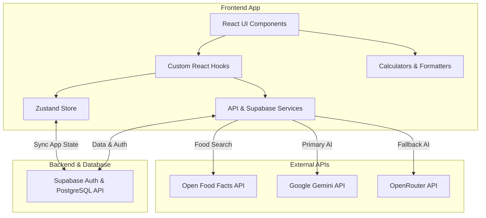
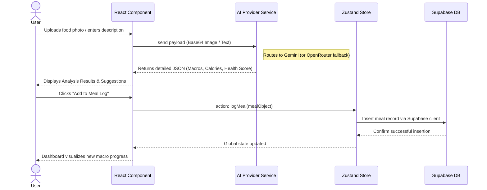

# EatWise AI 🥗

EatWise AI is a client-side nutrition and wellness tracker built with React and Vite. It helps users create a profile, calculate daily nutrition goals, log meals, analyze meals with AI, generate recipe ideas from available ingredients, and monitor wellness signals aligned with UN Sustainable Development Goal 3: Good Health and Well-Being.

The application utilizes Supabase for secure backend capabilities, authentication, and persistent database storage. It leverages Open Food Facts for nutritional search capabilities and utilizes Google Gemini or OpenRouter for AI-powered nutrition analysis, recipe generation, and daily wellness insights.

---

## 🏗️ Architecture Diagram

The application follows a modern full-stack architecture using React on the frontend and Supabase as a Backend-as-a-Service, with Zustand for client state management and direct integrations with AI APIs.



---

## 🔄 Data Flow Diagram

Below is the data flow for the core AI Meal Analysis and Logging feature.



---

## 🌍 Alignment with UN SDG 3 (Good Health and Well-Being)

EatWise AI is directly aligned with the United Nations Sustainable Development Goal 3, which aims to **ensure healthy lives and promote well-being for all at all ages**. Our platform contributes to this global objective by:
- **Promoting Preventive Healthcare:** By calculating daily nutritional needs and providing strict macro tracking, the app aids in managing weight and reducing the risk of diet-related non-communicable diseases (NCDs) like diabetes and heart disease.
- **Democratizing Nutrition Knowledge:** The AI Meal Analyzer empowers users with actionable insights and nutritional literacy, making it easier for communities to make informed, healthy dietary choices.
- **Encouraging Holistic Wellness:** Beyond mere calorie counting, EatWise focuses on overall holistic health. By tracking hydration, mental mood, sleep patterns, and physical health markers (like BMI), it provides a comprehensive Wellness Score to users.

---

## ✨ Features

### 👤 Personalized Onboarding & Profiling
- Collects detailed physiological and lifestyle metrics (age, weight, height, gender, activity level, and goals).
- Uses the clinically validated **Mifflin-St Jeor equation** to calculate daily basal metabolic rate (BMR) and recommended calorie limits.
- Tailors specific macronutrient (protein, carbs, fat) partitions based on the user's primary goal (losing, maintaining, or gaining weight).

### 📊 Dynamic Dashboard
- **Nutrition Overview:** Vivid visual representations showing current day's calorie expenditure and macronutrient progress.
- **Daily AI Insights:** Generates fresh, context-aware daily nutritional insights driven by AI relying on user's profile and habits.
- **Activity Tracking:** Maps weekly streaks and provides rapid navigation to core features like meal logging, recipes, and wellness checkpoints.
- Maintains a ledger of today's logged meals for instant review.

### 📝 Comprehensive Meal Logging
- Allows users to log distinct meals by exact dates (breakfast, lunch, dinner, snacks).
- Tightly integrated with the **Open Food Facts API** to search and automatically pull precise nutritional information based on barcodes and product names.
- Users can append custom calorie metrics, macros, and personal notes to individual entries.
- Full CRUD capabilities: easily track, edit, and delete food entries.

### 🤖 AI Meal Analyzer
- **Multi-modal Inputs:** Accepts both photographic images of a meal and detailed textual descriptions.
- **Nutritional Demystification:** Harnesses AI (Gemini / OpenRouter) to estimate calorie counts and intricate macro ratios.
- **Health Scoring:** Grades meals and provides a synthesized health score alongside specific health badges.
- **Actionable Feedback:** Supplies tailored, human-readable suggestions explaining the tangible health impacts of the food scanned. Can add these interpreted meals directly into your local Meal Log.

### 🍲 Smart Recipe Suggester
- AI-driven feature generating healthy, step-by-step recipes utilizing whatever ingredients the user inputs.
- Highly filterable by dietary restrictions/preferences (e.g., Vegan, Keto, Gluten-Free).
- Returns comprehensive culinary data: cooking instructions, preparation/cooking times, estimated nutritional breakdown, and active health benefits.
- Favorites system allowing users to safely tuck away preferred recipes for later usage.

### 🧘‍♀️ Health & Wellness Hub
- **BMI Tools:** Automatically calculates Body Mass Index and projects immediate health-risk categories.
- **Micro-Habit Tracking:** Incorporates hydration logging, mood surveying, and sleep quality diaries.
- **Holistic Wellness Score:** Aggregates BMI, logged meals accuracy, water intake, sleep quality, and mood to deliver a singular unified metric illustrating the user's total health status.
- Educates users with practical, nutrition-focused tips tailored against non-communicable diseases prevention.

### 🌗 Adaptive UI & Accessibility
- Complete Light/Dark mode theming options persisted in user settings.
- Highly interactive UI relying on Framer Motion and GSAP for fluid data transitions.

---

## 🛠️ Tech Stack

- **Framework:** React 19, Vite 8
- **Backend & Database:** Supabase (PostgreSQL, Auth)
- **Routing:** React Router
- **State Management:** Zustand
- **Data Fetching:** TanStack React Query
- **Animations:** Framer Motion, GSAP
- **Data Visualization:** Recharts
- **Icons & UI:** Lucide React, React Hot Toast
- **External Services:** 
  - Open Food Facts API
  - Google Gemini API
  - OpenRouter API

---

## 🗄️ Backend Structure (Supabase)

Our backend utilizes a robust relational PostgreSQL database hosted on Supabase, designed with strict Row Level Security (RLS) to ensure user data isolation.

The primary database schema consists of the following tables:
- **`profiles`**: Stores core user metrics (age, weight, height, gender), activity levels, dietary goals (lose, maintain, build), computed calorie/macro limits, and health conditions. Joined directly to `auth.users(id)`.
- **`meals`**: The ledger for nutritional tracking. Records date, meal type (breakfast, lunch, dinner, snack), calories, precise macros (protein, carbs, fat), and optional health badges/notes.
- **`favorites`**: A repository of AI-generated recipes the user saves, tracking prep/cook times, difficulty, ingredients, step-by-step instructions, and macros.
- **`water_intake`**: Tracks glasses of water consumed per user per day.
- **`wellness_checkins`**: Directly supports our SDG 3 tracking by recording daily `mood` and `sleep_quality` metrics linked to the user and date.
- **`streak_days`**: Maintains the user's activity streak markers.
- **`ai_analysis_logs`**: An audit trail storing AI nutritional evaluations (both image and text-based) and the subsequent health impact suggestions provided.

*All tables are indexed appropriately for quick `date` and `user_id` lookups and strictly protected via RLS policies so users can only `SELECT/INSERT/UPDATE/DELETE` their own rows using `auth.uid()` validation.*

---

## 📂 Project Structure

```text
EatWise AI/
  public/            # Static assets (favicons, reference images)
  src/
    assets/          # Image and graphic assets
    components/      # Reusable UI components
      auth/          # Auth styles and layout
      dashboard/     # Dashboard widgets and charts
      layout/        # App shell and navigation
      meals/         # Meal form and food search workflow
      ui/            # Reusable UI primitives (Buttons, Cards, Modals)
    hooks/           # React Query and custom logic hooks
    pages/           # Route-level screens (Dashboard, MealLog, AIAnalyzer, etc.)
    services/        # External API services (Gemini, OpenRouter, Food Facts)
    store/           # Global Zustand store
    utils/           # Constants, formatters, TDEE calculators, validators
    App.jsx          # Routes, context providers, and onboarding guard
    main.jsx         # React application entry point

```

---

## 🚀 Getting Started

### Prerequisites
- Node.js (Latest LTS version recommended)
- npm or yarn

### Installation
1. Clone the repository and install dependencies:
```bash
npm install
```

2. **Configure environment variables:**
Create a `.env` file in the project root:
```bash
cp .env.example .env
```
Add your API keys and Supabase credentials inside `.env`:
```env
VITE_SUPABASE_URL="your_supabase_project_url"
VITE_SUPABASE_ANON_KEY="your_supabase_anon_key"
VITE_GEMINI_API_KEY="your_gemini_api_key_here"
VITE_OPENROUTER_API_KEY="your_openrouter_api_key_here"
```
*(Note: For AI, only one key is strictly required. If both are provided, Gemini serves as the primary and OpenRouter as the fallback).*

### Available Scripts

- **`npm run dev`** - Starts the Vite development server on `http://localhost:5173`.
- **`npm run build`** - Creates a production build in the `dist/` directory.
- **`npm run preview`** - Serves the production build locally for verification.
- **`npm run lint`** - Lints the project files using ESLint.

---

## 💾 Data Persistence & Security

**Supabase Backend Integration:**  
Instead of local storage, user profiles, logs, and preferences are securely persisted using a Supabase PostgreSQL database. The application interacts with Supabase services natively to authenticate users and ensure their data is synced seamlessly across devices.

**Important Considerations:**
- Because this is a frontend-side Vite application, variables prefixed with `VITE_` are bundled and visible natively. For production, ensure Supabase RLS (Row Level Security) policies are properly enforced to protect user data from unauthorized access via the public API key.
- Evaluated nutrition responses from AI are estimates and should not be perceived as definitive medical advice.

---

## 🔧 Troubleshooting

- **App stuck loading or authorization failing?** 
  Ensure your Supabase project is active, your `.env` contains valid credentials, and Row Level Security policies permit reads/writes where appropriate.
- **AI features failing with authorization error?** 
  Verify your `.env` starts with `VITE_` and contains a valid token. Restart the Vite watcher via `npm run dev` anytime `.env` variables are modified.
- **No recipes/food found?** 
  Try simpler ingredient terminology. The AI relies on logical inputs and Open Food Facts depends on global crowdsourced inputs.

---

## 📜 License

This project is open-source and licensed under the [MIT License](https://opensource.org/licenses/MIT). You are free to use, modify, and distribute the code in accordance with the terms of the license.
